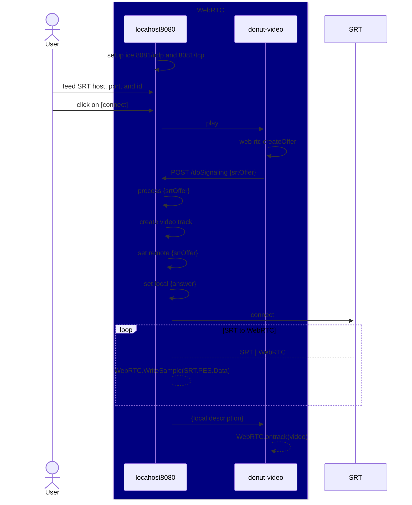

# Data flow diagram

```mermaid
sequenceDiagram
    actor User
    
    box Navy WebRTC
        participant locahost8080
        participant donut-video
    end

    locahost8080->>+locahost8080: setup ice 8081/udp and 8081/tcp
    User->>+locahost8080: feed SRT host, port, and id
    User->>+locahost8080: click on [connect]
    locahost8080->>+donut-video: play
    donut-video->>+donut-video: web rtc createOffer
    donut-video->>+locahost8080: POST /doSignaling {srtOffer}
    locahost8080->>+locahost8080: process {srtOffer}
    locahost8080->>+locahost8080: create video track
    locahost8080->>+locahost8080: set remote {srtOffer}
    locahost8080->>+locahost8080: set local {answer}
    locahost8080->>+SRT: connect

    loop SRT to WebRTC
        locahost8080-->SRT: SRT | WebRTC        
        locahost8080-->locahost8080: WebRTC.WriteSample(SRT.PES.Data)
    end
    
    locahost8080->>+donut-video: {local description}

    donut-video-->>donut-video: WebRTC.ontrack(video)
```
