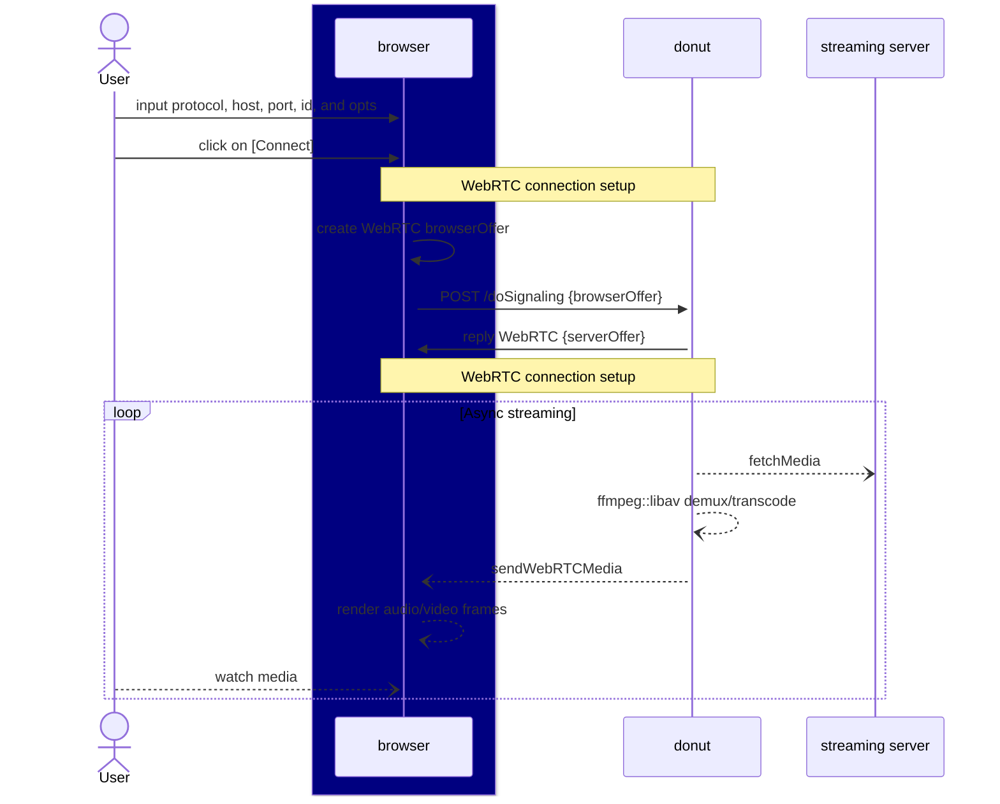
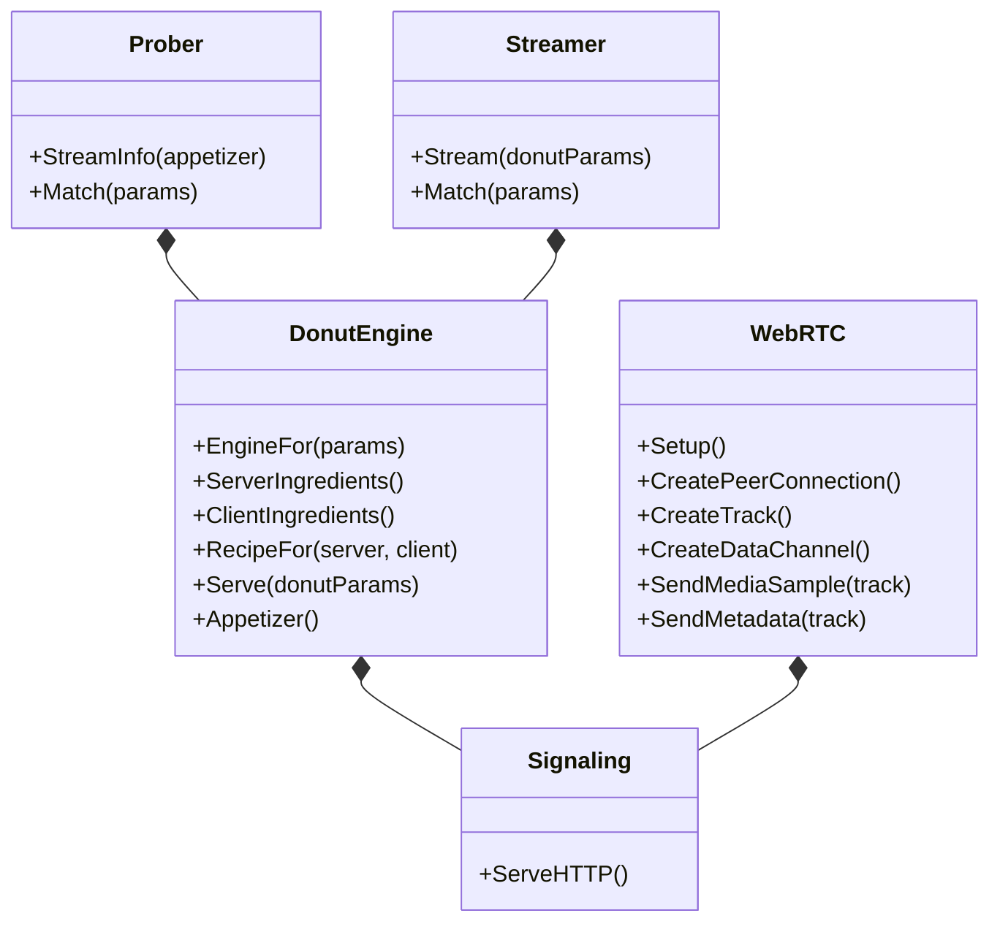

# INTRODUCTION

```golang
// build the a donut engine for user's input (ie: srt://server)
donutEngine := h.donut.EngineFor(reqParams)
// fetches the server-side stream info (codec, ...)
serverStreamInfo := donutEngine.ServerIngredients(reqParams)
// gets the client side media support (codec, ...)
clientStreamInfo := donutEngine.ClientIngredients(reqParams)
// creates the necessary recipe (by pass, transcoding from A to B, etc)
donutRecipe := donutEngine.RecipeFor(reqParams, serverStreamInfo, clientStreamInfo)

// serve asynchronously the server stream to the client web rtc
go donutEngine.Serve(&entities.DonutParameters{
	Recipe: *donutRecipe,
	OnVideoFrame: func(data []byte, c entities.MediaFrameContext) error {
		return webRTC.SendMediaSample(VIDEO_CHANNEL, data, c)
	},
	OnAudioFrame: func(data []byte, c entities.MediaFrameContext) error {
		return webRTC.SendMediaSample(AUDIO_CHANNEL, data, c)
	},
})

```

# DATA FLOW DIAGRAM



# CORE COMPONENTS

