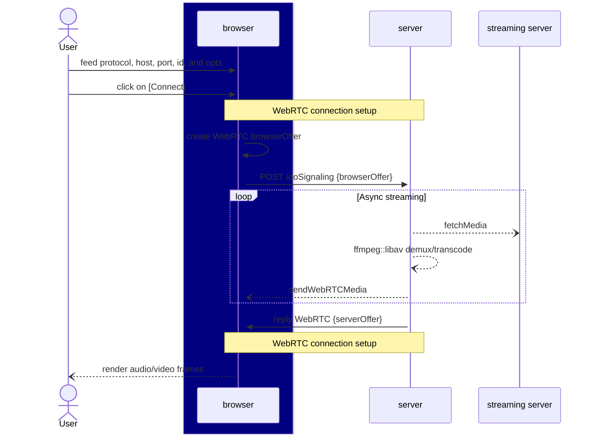
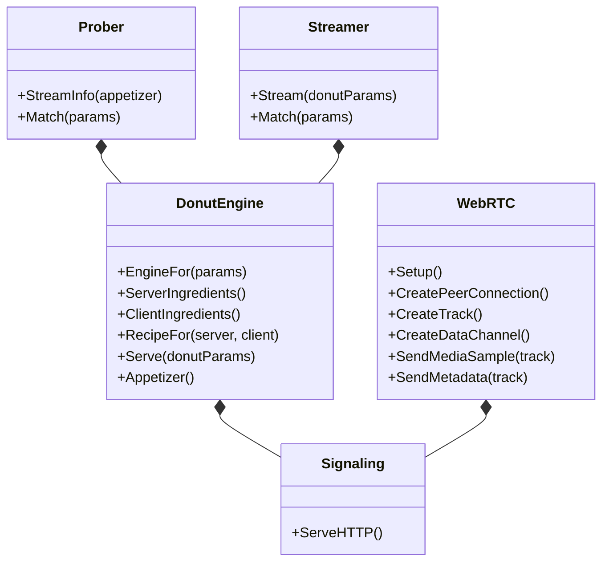

# Data flow diagram

```mermaid
sequenceDiagram
    actor User

    box Navy
        participant browser
    end

    User->>+browser: feed protocol, host, port, id, and opts
    User->>+browser: click on [Connect]
    
    Note over server,browser: WebRTC connection setup
    
    browser->>+browser: create WebRTC browserOffer
    browser->>+server: POST /doSignaling {browserOffer}

    loop Async streaming
        server--)streaming server: fetchMedia
        server--)server: ffmpeg::libav demux/transcode
        server--)browser: sendWebRTCMedia
    end

    server->>+browser: reply WebRTC {serverOffer}

    Note over server,browser: WebRTC connection setup
    
    browser--)User: render audio/video frames
```

# Architecture

```mermaid
classDiagram
    class Signaling{
        +ServeHTTP()
    }

    class WebRTC{
        +Setup()
        +CreatePeerConnection()
        +CreateTrack()
        +CreateDataChannel()
        +SendMediaSample(track)
        +SendMetadata(track)
    }

    class DonutEngine{
        +EngineFor(params)
        +ServerIngredients()
        +ClientIngredients()
        +RecipeFor(server, client)
        +Serve(donutParams)
        +Appetizer()
    }

    class Prober {
        +StreamInfo(appetizer)
	    +Match(params)
    }

    class Streamer {
        +Stream(donutParams)
	    +Match(params)
    }

    DonutEngine *-- Signaling
    WebRTC *-- Signaling
    Prober *-- DonutEngine
    Streamer *-- DonutEngine
```