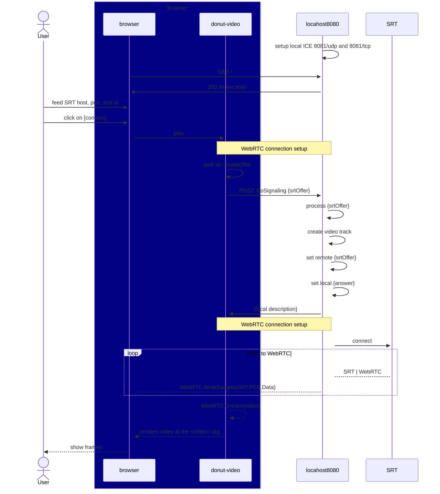

# Data flow diagram

```mermaid
sequenceDiagram
    actor User

    box Navy Browser
        participant browser
        participant donut-video
    end

    locahost8080->>+locahost8080: setup local ICE 8081/udp and 8081/tcp
    browser->>+locahost8080: GET /
    locahost8080->>+browser: 200 /index.html
    User->>+browser: feed SRT host, port, and id
    User->>+browser: click on [connect]
    browser->>+donut-video: play

    Note over locahost8080,donut-video: WebRTC connection setup

    donut-video->>+donut-video: web rtc createOffer
    donut-video->>+locahost8080: POST /doSignaling {srtOffer}
    locahost8080->>+locahost8080: process {srtOffer}
    locahost8080->>+locahost8080: create video track
    locahost8080->>+locahost8080: set remote {srtOffer}
    locahost8080->>+locahost8080: set local {answer}
    locahost8080->>+donut-video: {local description}

    Note over locahost8080,donut-video: WebRTC connection setup

    locahost8080->>+SRT: connect

    loop SRT to WebRTC
        locahost8080-->SRT: SRT | WebRTC
        locahost8080-->browser: WebRTC.WriteSample(SRT.PES.Data)
    end

    donut-video-->>donut-video: WebRTC.ontrack(video)
    donut-video-->>browser: renders video at the <video> tag
    browser-->>User: show frames
```
