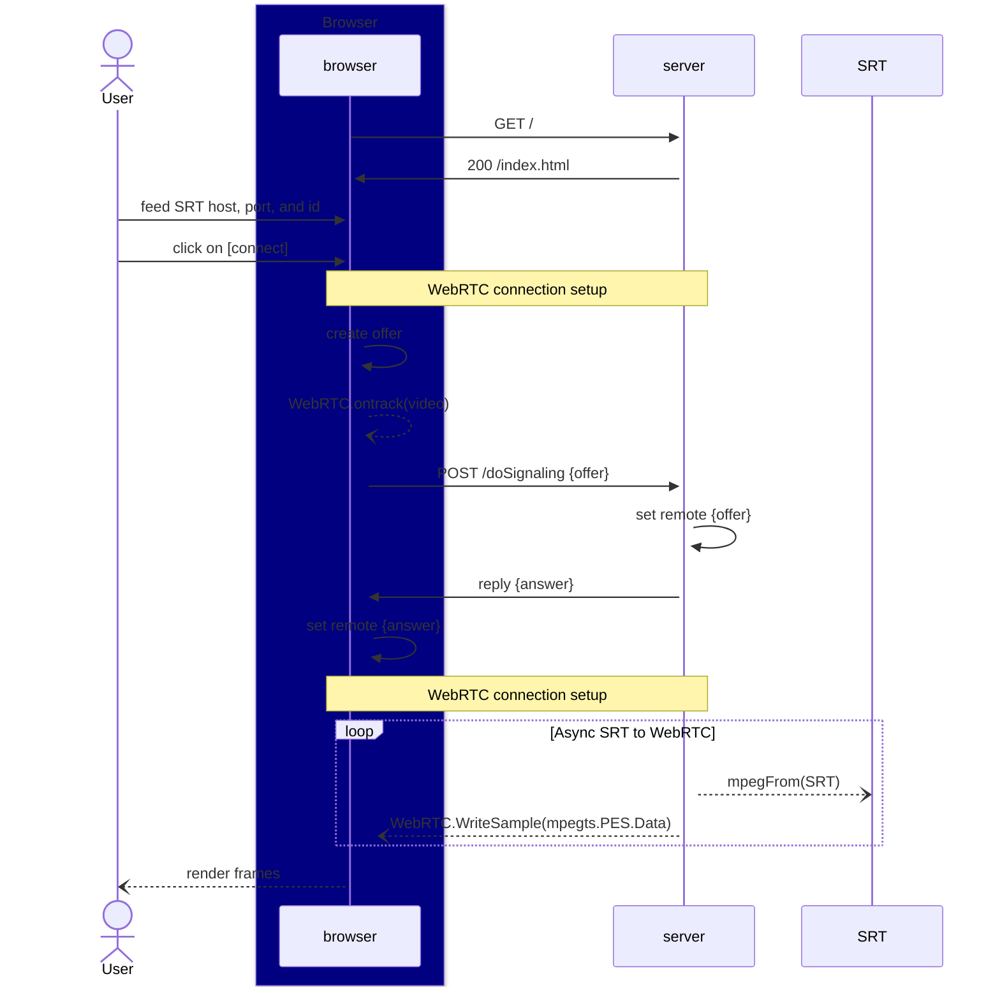

# Data flow diagram

```mermaid
sequenceDiagram
    actor User

    box Navy Browser
        participant browser
    end
 
    browser->>+server: GET /
    server->>+browser: 200 /index.html
    User->>+browser: feed SRT host, port, and id
    User->>+browser: click on [connect]
    
    Note over server,browser: WebRTC connection setup
    
    browser->>+browser: create offer
    browser--)browser: WebRTC.ontrack(video)
    browser->>+server: POST /doSignaling {offer}
    server->>+server: set remote {offer}
    server->>+browser: reply {answer}
    browser->>+browser: set remote {answer}

    Note over server,browser: WebRTC connection setup

    loop Async SRT to WebRTC
        server--)SRT: mpegFrom(SRT)
        server--)browser: WebRTC.WriteSample(mpegts.PES.Data)
    end

    
    browser--)User: render frames
```
