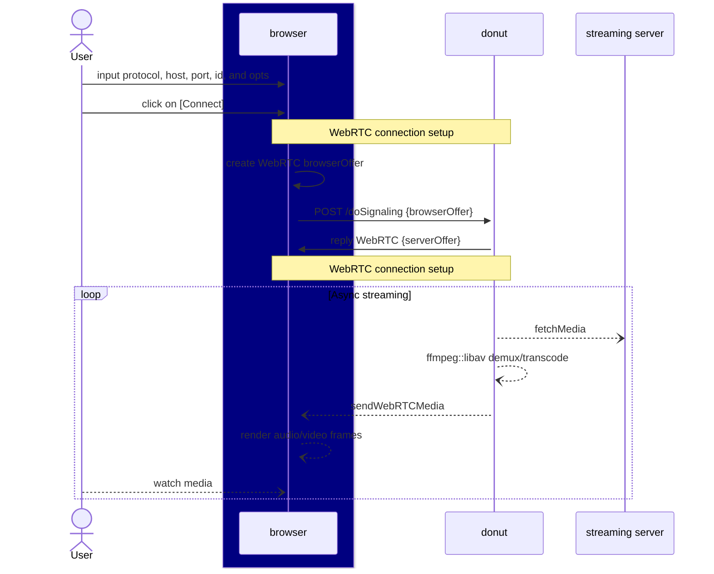
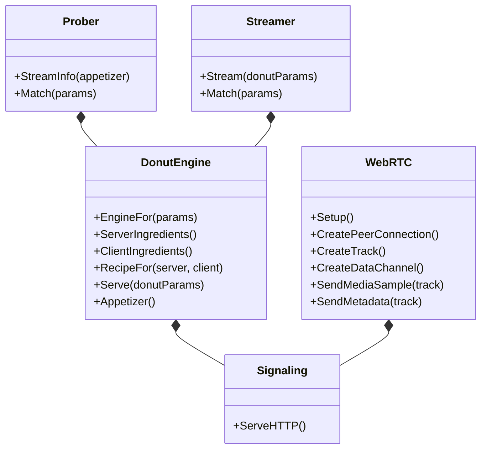

# INTRODUCTION

```golang
// It builds an engine based on user inputs
// {url: url, id: id, sdp: webRTCOffer}
donutEngine := donut.EngineFor(reqParams)
// It fetches the server-side (streaming server) stream info (codec, ...)
serverStreamInfo := donutEngine.ServerIngredients(reqParams)
// It gets the client side (browser) media support (codec, ...)
clientStreamInfo := donutEngine.ClientIngredients(reqParams)
// Given the client's restrictions and the server's availability, it builds the right recipe.
donutRecipe := donutEngine.RecipeFor(reqParams, serverStreamInfo, clientStreamInfo)

// It streams the media from the backend server to the client while there's data.
go donutEngine.Serve(DonutParameters{
	Recipe: donutRecipe,
	OnVideoFrame: func(data []byte, c MediaFrameContext) error {
		return SendMediaSample(VIDEO_TYPE, data, c)
	},
	OnAudioFrame: func(data []byte, c MediaFrameContext) error {
		return SendMediaSample(AUDIO_TYPE, data, c)
	},
})
```

# DATA FLOW DIAGRAM



# CORE COMPONENTS

