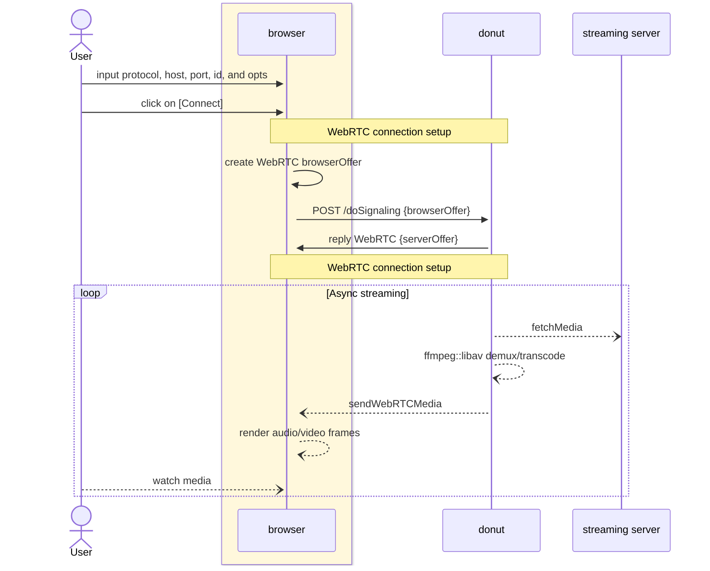

**donut** is a zero setup required [SRT](https://en.wikipedia.org/wiki/Secure_Reliable_Transport) (_MPEG-TS_) and [RTMP](https://en.wikipedia.org/wiki/Real-Time_Messaging_Protocol) to [WebRTC](https://webrtc.org/) bridge powered by [Pion](http://pion.ly/).

# HOW IT WORKS




ref: [how donut works](/HOW_IT_WORKS.md)

# QUICK START

Make sure you have the `ffmpeg 5.x.x`. You must configure the CGO library path pointing it to **ffmpeg 5**.

```bash
export CGO_LDFLAGS="-L/opt/homebrew/Cellar/ffmpeg@5/5.1.4_6/lib/"
export CGO_CFLAGS="-I/opt/homebrew/Cellar/ffmpeg@5/5.1.4_6/include/"
export PKG_CONFIG_PATH="/opt/homebrew/Cellar/ffmpeg@5/5.1.4_6/lib/pkgconfig"
```

Now you can install and run it:

```bash
go install github.com/flavioribeiro/donut@latest
donut
```

Here are specific instructions [to run on MacOS](/MAC_DEVELOPMENT.md).

# RUN USING DOCKER-COMPOSE

Alternatively, you can use `docker-compose` to simulate an [SRT live transmission and run the donut effortless](/DOCKER_DEVELOPMENT.md).

```bash
make run
```

## OPEN THE WEB UI
Open [http://localhost:8080/demo](http://localhost:8080/demo). You will see two text fields. Fill them with the your streaming info and hit connect.


### FAQ

Please check the [FAQ](/FAQ.md) if you're facing any trouble.
