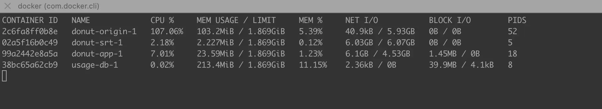
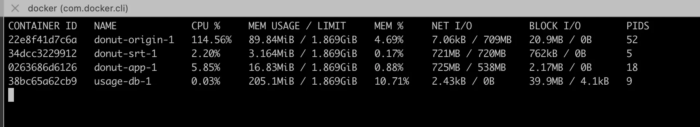

# Add tests/CI/linter

* add ffmpeg test utility
* add run test locally
* add run linter on docker
* tag integration tests // +build integration || go test -tags integration -v ./...

# Adding audio (WIP)

## Date: 2/4/24
### Summary: Adding audio track

* add support to detect server side streams information
* add support to intercept stream as it goes (middleware: useful for gathering data such as media info, bitrate, eia608, etc)
* TODO: test push directly vp8 and ogg through rtc (is it possible through SRT?)
* TODO: test push directly h264 and aac through
* TODO: test transcode server side stream (h264 and aac) to client side stream support (vp8/vp9/ogg) through libav/ffmpeg.
	// selects proper media that client and server has adverted.
	// donutEngine preferable vp8, ogg???
	// From: [] To: [] or Transcode:[], Bypass: []
	// libav_streamer.go, libav_streamer_format.go, libav_streamer_codec.go...
	// reads from Server (input) and generates h264 raw, and ogg and send it with timing attributes

refs:
* binding go https://github.com/asticode/go-astiav
* transcoding https://github.com/asticode/go-astiav/blob/master/examples/transcoding/main.go
* using buffer streaming https://github.com/bubbajoe/go-astiav-contr/blob/misc-update/examples/gocv/main.go#L167
* (working) go webrtc same stream https://github.com/pion/webrtc/blob/v3.2.24/examples/play-from-disk/main.go#L88C39-L88C64
* (working) https://jsfiddle.net/8kup9mvn/
* (two tracks - js side) https://www.youtube.com/watch?v=8I2axE6j204

* webrtc discussion https://github.com/pion/webrtc/discussions/1955
* go webrtc example https://github.com/pion/webrtc/blob/master/examples/play-from-disk-renegotiation/main.go
* webrtc discussion https://stackoverflow.com/questions/66243915/how-to-get-multiple-streams-from-webrtc-peerconnection
* golang libav https://github.com/giorgisio/goav/blob/master/example/tutorial01.go#L69
* libav transcoding example gshttps://github.com/FFmpeg/FFmpeg/blob/master/doc/examples/transcode.c#L158
* libav network example https://github.com/FFmpeg/FFmpgseg/blob/master/doc/examples/avio_http_serve_files.c#L116
* libav avio example https://github.com/FFmpeg/FFmpeg/blob/master/doc/examples/avio_read_callback.c#L95
* example https://blog.mi.hdm-stuttgart.de/index.php/2018/03/21/livestreaming-with-libav-tutorial-part-2/
* libav doc https://ffmpeg.org/doxygen/trunk/index.html
* generic av format https://github.com/rvs/ffmpeg/blob/master/libavformat/output-example.c
* mpegts example https://github.com/wakabayashik/mpegts-to-webrtc/blob/main/main.go

* network use https://github.com/asticode/go-astiav/issues/7
* srt live https://github.com/Haivision/srt/blob/master/docs/features/live-streaming.md

# Moving player to static

## Date: 2/3/24
### Hypothesis: It's easy to do experimentation with local player
### Summary

Copy and adapt code from https://github.com/flavioribeiro/donut-video into static/demo/

# Investigating a potential memory leak

## Date: 2/2/24
### Hypothesis: There's a memory leak happening
### Signs: pprof/allocs

### Summary

* Start the donut `make run`, 
* Check the general profiling http://localhost:6060/debug/pprof/?debug=1
* Keep refreshing the page, notice that the counters: heap, goroutine, threadcreate are stable
* Access the the demo http://localhost:8080/
* Go back to the profiling page http://localhost:6060/debug/pprof/?debug=1
* Notice that the prof counters are stable, regardless if you refresh multiple times
* Now click on `[Connect]`
* Observe how the perf counters go up http://localhost:6060/debug/pprof/?debug=1
* Keep refreshing the http://localhost:6060/debug/pprof/? and you'll see that the counters `goroutine` and `threacreate` **are stable** but `heap` and `allocs` **counters are growing**.
  * You can check the specific heap page as well http://localhost:6060/debug/pprof/heap?debug=1
  * You can run the command `go tool pprof http://localhost:6060/debug/pprof/heap` and type `web`, it'll generate a svg tree map of heap.
    * Snapshot 1 at time `Start + 4 m`
    * 
    * Snapshot 2 at time `Start + 15 m`
    * 
    * Snapshot 2 at time `Start + 8 h`
    * 
    * Docker stats `docker stats` at `Start`
    * 
    * Docker stats `docker stats` at `Start + 10m`
    * 

> ref: https://go101.org/article/memory-leaking.html
### Conclusion: there's not leak, I confused allocs growing nature.